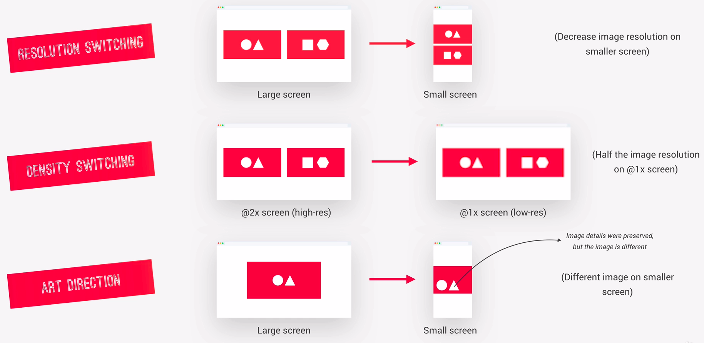

# Media Queries

### Media queries don't add any importance or specificity to selectors, so code order matters - media queries at the end.

<br>

For the hover effect but not working on phone or tablet devides, we can use the following method:

```css
@media only screen and (max-width: 56.25rem),
only screen and (hover: none) {
	...
}
```


<br><br>


# Responsive Images

### Responsive image in HTML:

For example:

```html


```

another example:

```html
<picture class="footer__logo">
    <source srcset="img/logo-green-small-1x.png 1x, img/logo-green-small-2x.png 2x" media="(max-width: 37.5em)">
    
</picture>
```

<br>

### Responsive image in CSS:

Safari doesn't not support `min-resolution`, so we need to use `-webkit-min-device-pixel-ratio` instead.



```css
/*1.25 dpr*/
@media
only screen and (min-resolution: 120dpi) and (min-width: 37.5rem),
only screen and (-webkit-min-device-pixel-ratio: 1.25) and (min-width: 37.5rem) {
/* When DPR is above 1.25, and min-resolution device resolution is 120dpi, this style will be applied */
}
/*1.5 dpr*/
@media
only screen and (min-resolution: 144dpi) and (min-width: 37.5rem),
only screen and (-webkit-min-device-pixel-ratio: 1.5) and (min-width: 37.5rem) {
/* When DPR is above 1.5, and min-resolution device resolution is 144dpi, this style will be applied */
}

/*2.0 dpr, iPhone use this one*/
@media
only screen and (min-resolution: 192dpi) and (min-width: 37.5rem),
only screen and (-webkit-min-device-pixel-ratio: 2.0) and (min-width: 37.5rem) {
/* When DPR is above 2.0, and min-resolution device resolution is 192dpi, this style will be applied */
}
```

<br>

# Testing for Browser Support with `@supports`

If the browser supports these properties, it will run the inside codes. Otherwise, run the outside codes.

The following codes like `(clip-path: polygon(0 0)) or (-webkit-clip-path: polygon(0 0))`, we can put any values on it, it doesn't matter.

```css
.shape {
	height: 60rem;

	@supports (clip-path: polygon(0 0)) or (-webkit-clip-path: polygon(0 0)) {
		-webkit-clip-path: circle(50% at 50% 50%);
		clip-path: circle(50% at 50% 50%);
		-webkit-shape-outside: circle(50% at 50% 50%);
		shape-outside: circle(50% at 50% 50%);
	}
}
```